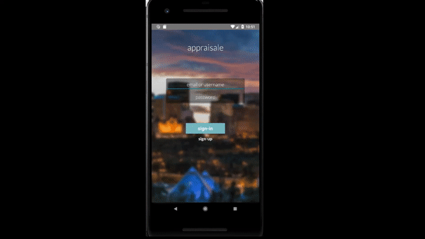
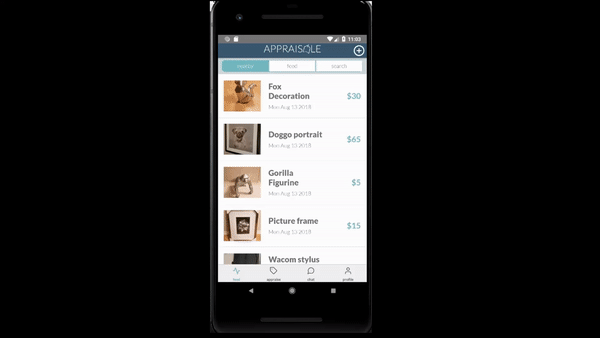
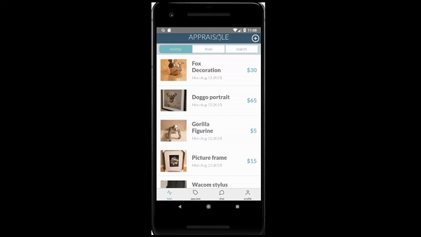

# Appraisale
First React Native app started as part of Startup Edmonton's Student Summer Program

Worked on the project through the summer of 2018, was first time for me coding in JavaScript and React Native.
The backend for this project was written in NodeJS and ran through Amazon Web Services. The code for the entire project is available on Git but through a private repository (in case I ever come back and eventually make this into a full on startup). Just ask to see any of the code and I'd be happy to share!

Huge thanks to Startup Edmonton for giving us resources to develop our idea and work on it in their offices throughout the summer. Check them out at http://www.startupedmonton.com/. Also thank you to the developers who helped where they could to bring this app and project to life, Andy Yip, Tyler Arsenault @TylerA73, Christian Ellinger @skwidz, Jayden Laturnus @JJJados.

